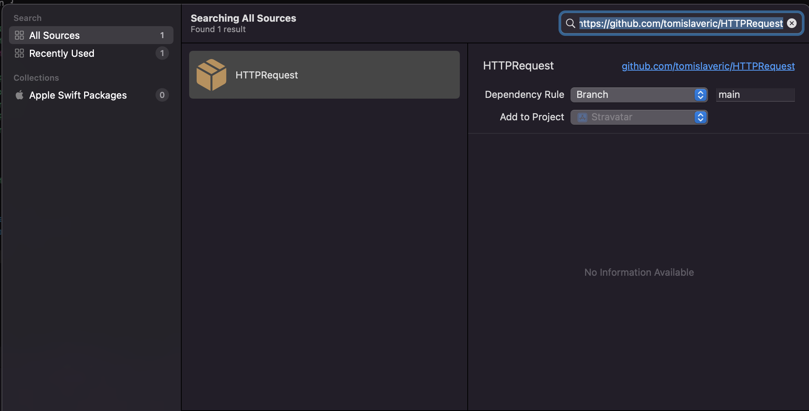

# HTTPRequest

Yet another HTTPRequest wrapper. HTTP requests are written with async/await. 
So far GET and POST requests are possible

## Why do i need this package?

In almost every project i need to make HTTP request (GET, POST...) and then the JSON result has to be decoded to some model. I am tired of writing it everytime again and again. Here i've create a Swift Package with the most up to date way of doing this. No Closures and stuff, just simple and readble async await functions with type inference to parse the result by JSONDecoder. 

## Installation

1. Within your project, click on `File -> Add Packages` and paste into the input this repo URL `https://github.com/tomislaveric/HTTPRequest`. Click on `Add Package`.
2. Click on the Target of your project. Within General tab you will see **Frameworks, Libraries, and Embedded Content** Add HTTPRequest there as dependency. Thats it!



## Usage

```Swift
import HTTPRequest

let httpRequest: HTTPRequest = HTTPRequestImpl()
        
    // Trigger a HTTPRequest within a asynchronous context, a Task for example
    Task {
        // You just have to specify the type, here Activity for example. 
        // The result will be automatically parsed by inferring the type automatically.
        let activity: Activity = try await httpRequest.get(url: "https://www.boredapi.com/api/activity")
    }
```

## Troubleshoot

If you encounter errors like this in XCodes console, you need to go to toggle `incoming/outcoming connections` for your **App Sandbox**. You can find it in `Signing and Capabilities` at your projects target.

* `NSUnderlyingError=0x6000021db390 { Error Domain=kCFErrorDomainCFNetwork Code=-1003 "(null)"`

* `Error Domain=NSURLErrorDomain Code=-1003 "A server with the specified hostname could not be found."`


## Roadmap

[ ] Add handling for custom headers